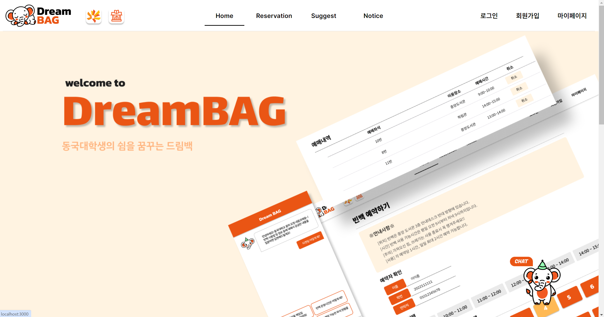
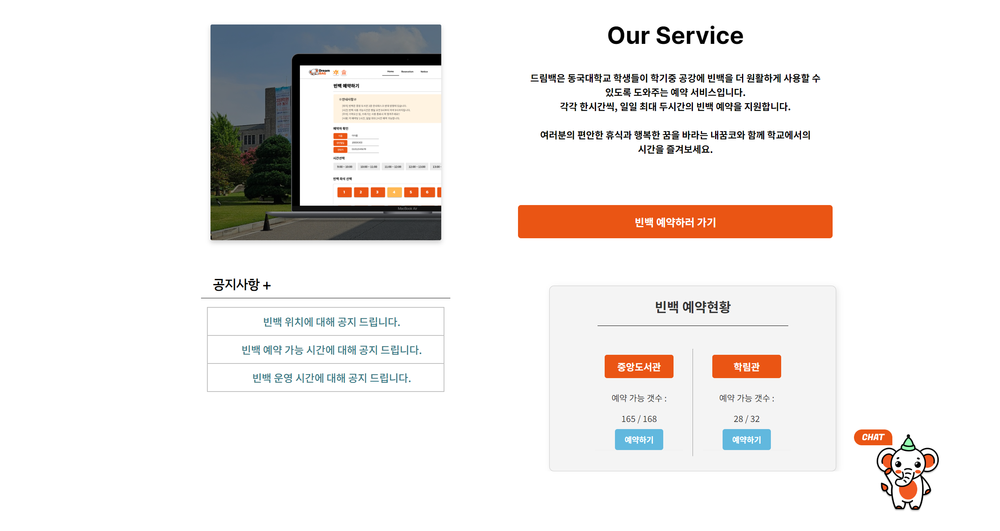
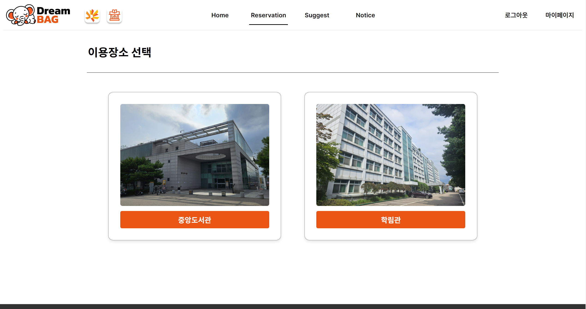
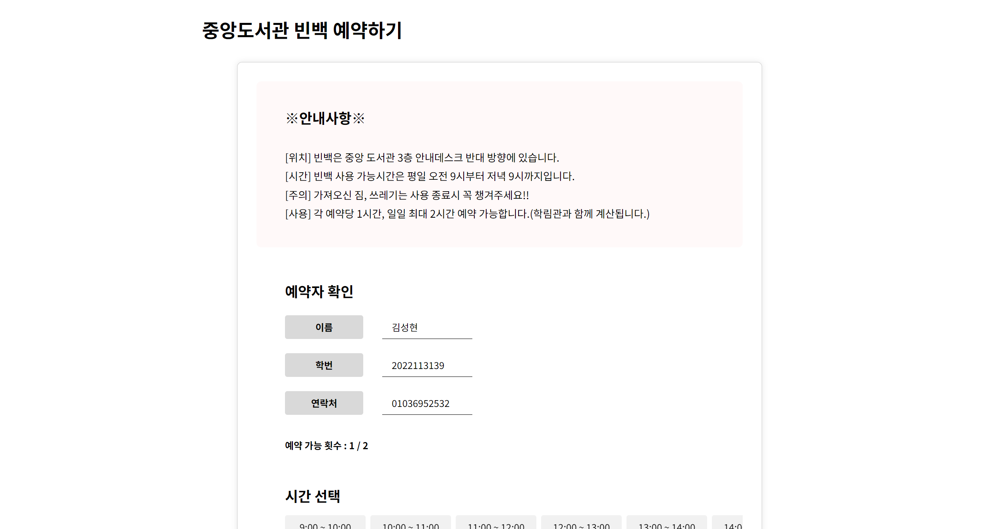
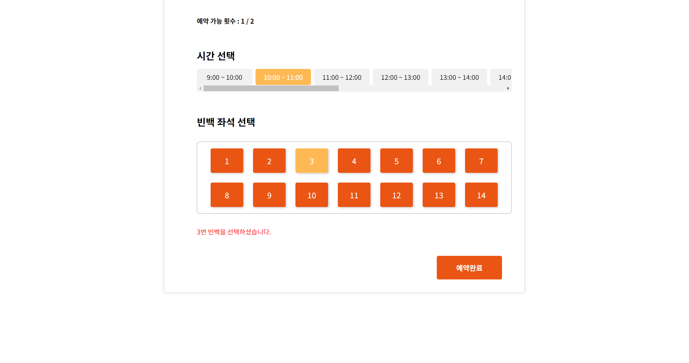
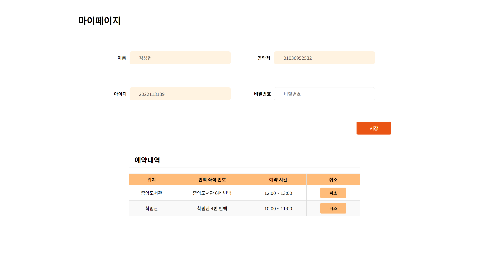
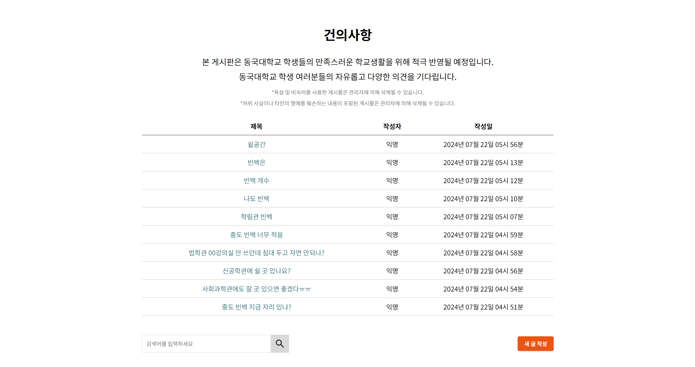
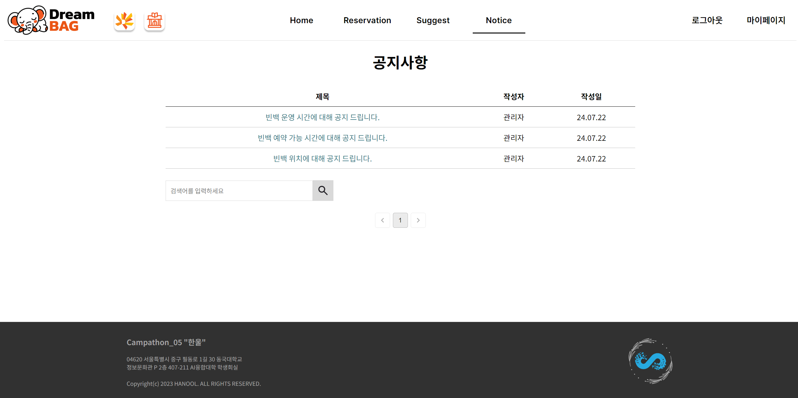
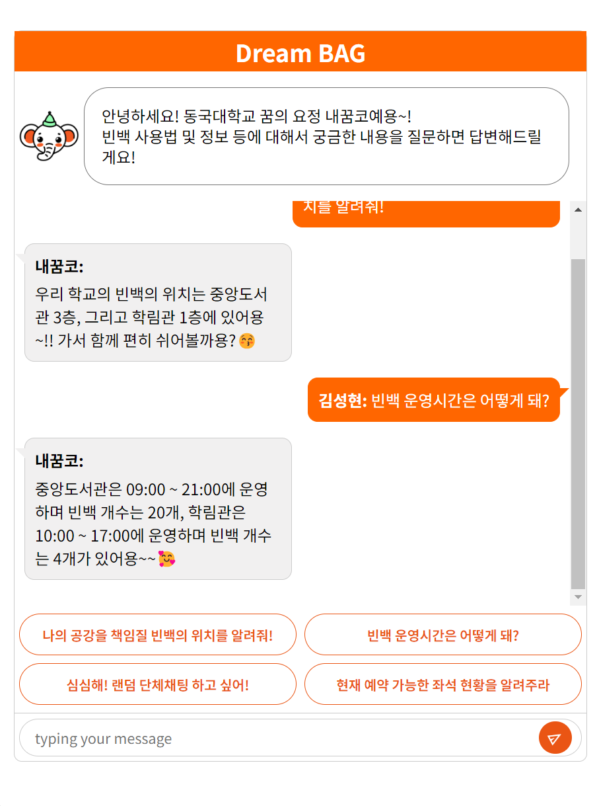
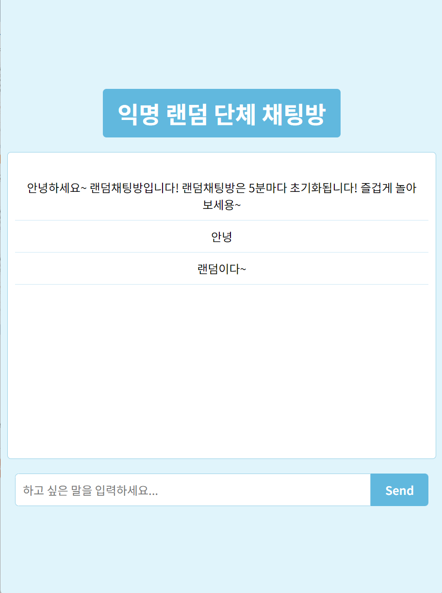

# 🏫 우리의 공강시간을 위하여

## 👨‍🏫 프로젝트 소개

학교 내 쉼 공간의 효율적 사용을 위해 온라인 당일 예약/소통하는 서비스를 제작해보았습니다.

## 🎯 주요 기능

- **실시간 예약**: 실시간 좌석 현황 확인 및 시간대별 예약이 가능합니다.
- **건의사항 접수**: 학교 내 휴식 공간에 대한 불편, 요구 사항을 게시할 수 있습니다.
- **챗봇 기능**: 필요한 정보에 관한 빠른 답변 및 간단한 질의응답이 가능합니다.
- **단체 익명 채팅방**: 5분에 한 번씩 초기화되며, 사용자 간의 소통이 가능합니다.
- **예약 관리**: 마이페이지 내에서 예약 확인 및 취소 기능을 제공합니다.

## 👥 팀원

- 이가연, 장은재: 프론트엔드 개발
- 김성현, 정은이: 백엔드 개발
- 이예은: 디자인
- 조명기: 기획

## 🔧 기술 스택

- **프론트엔드**: React, Axios
- **백엔드**: Node.js, Express, MySQL
- **배포**: Google Cloud, VM instance
- **버전 관리**: Git, GitHub

## 🚀 배포 링크

- [프로젝트 링크](http://한울.홈페이지.한국:3000)

  
   
메인 홈 상단

  
   
메인 홈 하단

  
   
예약 장소 선택

  
   
예약 폼 상단

  
   
예약 폼 하단

  
   
마이페이지 내 예약내역

  
   
건의사항 게시판

  
   
공지사항

  
   
챗봇 팝업 창

  
   
익명 단체 채팅방

